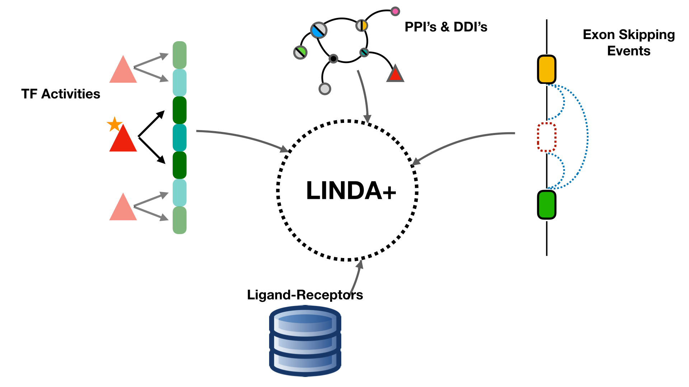
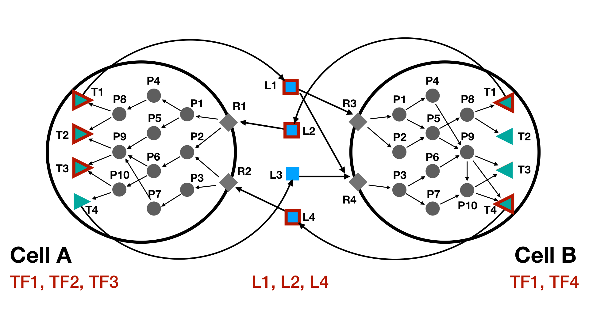

# Pipeline
LINDA+ is a method used to identify intra- and inter-cellular interaction
networks at a domain resolution, allowing to further study the effects of AS
on signalling. It is a tool that integrates prior knowledge (PKN) 
of directed joint interactions (protein-protein and Domain-Domain intra-cellular
interactions from DIGGER (Louadi et al. 2021)) as well as structurally resolved 
ligand-receptor pairs from various resources (list of resources when ready) with 
estimated transcription factor enzymatic activities from DoRothEA 
(Garcia-Alonso et al. 2019) based on sc-RNAseq reads and abundances of secreted 
extra-cellular proteins from Secretomics data analysis. This is achieved by 
contextualising large-scale prior knowledge of joint interactions from 
sequencing and MS/MS data in order to identify a subset of functional 
interactions between proteins and their domains through the implementation of an 
Integer Linear Programming (ILP) formulation. The pipeline of the LINDA+ 
methodology has been depicted in **Figure 1**.

{width=100%}


## The inputs of the method consist of the following:

**1.**	From the DoRothEA (Garcia-Alonso et al., 2018) resource, normalized TF 
enrichment scores (NESs) can be estimated with viper (Shen et al. 2014; 
Alvarez et al. 2016). Based on their activities, the most regulated TF’s can 
then be used as the bottom layer of signalling from where we reverse-engineer 
the upstream regulatory interactions.

**2.**	Abundances of ligands obtained from LC-MS secretomics. TBD: How to use
secretomics data as inputs.

**3.**	A joint network graph from DIGGER (Louadi et al. 2021) that integrates 
PPIs and DDIs and in which nodes represent protein domains defined by 
concatenating Entrez and Pfam id. The resource contains database tables for both 
genomic data, e.g. genes with their corresponding transcript and exon 
coordinates, and for proteins, e.g. isoforms and their domains. The protein 
coordinates were converted to genomic coordinates in the coding sequence and 
both tables are merged to be able to map transcripts with their corresponding 
exons to the corresponding protein isoforms and Pfam domains.

**4.**	Structurally resolved ligand-receptor pairs from various resources.
TBD: What resources to use

# Examples
Below are provided examples which help the user to better understand the
functioning of the LINDA+ R-package and the format of the LINDA+ inputs.

## Toy Example
Below are provided the steps of running a small Toy test study.

### 1. Loading of the required packages
R-packages needed to for the analysis.

```{r, message=FALSE}
library(LINDAPlus)
library(XML)
```

### 2. Loading of a list object containing prior knowledge of joint intra-cellular PPI-DDI's and extra-cellular L-R pairs
The list consists of two elements:

**background.networks:** This should be a named (cell-types) list containing
data-frames joint PPI-DDI's for each cell-type. Each data-frame represents
the set of interaction knowledge for each cell-type and it should contain at
least 4 columns with the following ID's: 'pfam_source', 'pfam_target',
'gene_source' and 'gene_target'. In the case where we have no name for a
specific domain or where this is not applicable, please set the corresponding
values in the 'pfam_source' or 'pfam_target' as NA's.

**ligand.receptors:** This also should be a named list ('ligands' and 
'Receptors') which contains character vectors where the set of elements that 
corresponds to Ligands and Receptors have been defined as such.

```{r, warning=FALSE}
load(file = system.file("extdata", "toy.background.networks.list.RData", package = "LINDAPlus"))
print(background.networks.list)
```


### 3. Loading of TF activity scores for each cell-type
This information should be provided as a named list (for each cell-type) and
which contains data-frames indicating the enrichment scores for each TF at each
cell-type. The data-frames should contain at least two columns: 'tf' 
(indicating the TF ID) and the numerical 'score' (indicating the enrichment 
scores for each TF).

```{r, warning=FALSE}
load(file = system.file("extdata", "toy.tf.scores.RData", package = "LINDAPlus"))
print(tf_scores)
```

Additionally users can provide a named (also by cell-type) numerical 
vector to indicate the number of TF's to consider as significantly regulated
based on their absolute enrichment values. In case that this parameter has not 
been defined, then by default all the TF's provided in the data-frames list will
be considered as significantly regulated.

```{r, warning=FALSE}
load(file = system.file("extdata", "toy.top.tf.RData", package = "LINDAPlus"))
print(top)
```


### 4. Loading of Ligand scores
Users can provide information about the abundance of ligands in the 
extra-cellular space as made evident by Secretomics data through a data-frame
object. More abundant ligands/extra-cellular molecules are more likely to 
initiate conformational changes in receptors. The data-frame provided should
contain two columns: 'ligands' (providing the ligand ID's) and 'score' 
(providing the score associated to each ligand, i.e. abundance). The higher the
score of the ligand, the more likely it will be for a ligand to appear in the
solution.

```{r, warning=FALSE}
load(file = system.file("extdata", "toy.ligand.scores.RData", package = "LINDAPlus"))
print(ligand_scores)
```


In **Figure 2** is provided a depiction of the Toy case background network 
(showing only the proteins) for two cell-types (CellA and CellB). Nodes 
representing significantly regulated ligands and TF's have been depicted with
red border. 

{width=100%}

### 5. LINDA+ Analysis
Once the inputs are available, the users can the proceed with the LINDA+ 
network analysis. The regulatory networks can be inferred by executing the 
```runLINDAPlus()``` function. Details about how to use this function can be 
obtained by using the ```?runLINDAPlus``` command.

Below is shown an example of how we can use the ```runLINDAPlus()``` function given
the inputs from the toy example as well as making use of the default
CPLEX optimization parameters.

```{r, message=FALSE}
res <- runLINDAPlus(background.networks.list = background.networks.list, 
                    ligand.scores = ligand_scores, 
                    tf.scores = tf_scores, 
                    solverPath = "~/Downloads/cplex", 
                    top = top)

print(res$combined_solutions)
```

The output of the analysis is a list object containing the separate LINDA+ 
analysis optimal networks (```res$separate_solutions```) as well as matrices
containing all the integrated interactions obtained from each of the separate
solutions for CellA (```res$combined_solutions$CellA```), CellB
(```res$combined_solutions$CellB```) and interactions between cells through the
L-R pairs (```res$combined_solutions$ligand_receptors```). In **Figure 3** the
optimal network as visualized from a protein level is provided.

{width=100%}
