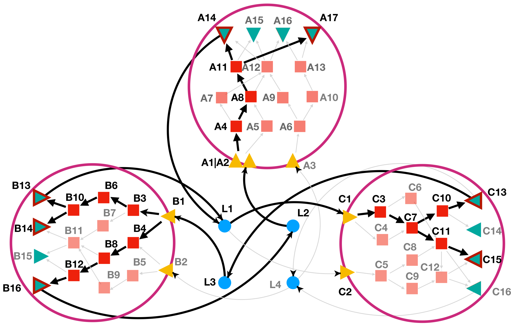

# Pipeline
LINDA+ is a method used to identify intra- and inter-cellular interaction
networks at a domain resolution, allowing to further study the effects of AS
on signalling. It is a tool that integrates prior knowledge (PKN) 
of directed joint interactions (protein-protein and Domain-Domain intra-cellular
interactions from DIGGER (Louadi et al. 2021)) as well as structurally resolved 
ligand-receptor pairs from various resources (list of resources when ready) with 
estimated transcription factor enzymatic activities from DoRothEA 
(Garcia-Alonso et al. 2019) based on sc-RNAseq reads and optionally abundances 
of secreted extra-cellular proteins from Secretomics data analysis. This is 
achieved by contextualising large-scale prior knowledge of joint interactions 
from sequencing and MS/MS data in order to identify a subset of functional 
interactions between proteins and their domains through the implementation of an 
Integer Linear Programming (ILP) formulation. The pipeline of the LINDA+ 
methodology has been depicted in **Figure 1**.

{width=100%}


## The inputs of the method consist of the following:

**1.**	From the DoRothEA (Garcia-Alonso et al., 2018) resource, normalized 
transcription factor (TF) enrichment scores (NESs) can be estimated with viper 
(Shen et al. 2014; Alvarez et al. 2016). Based on their activities, the most 
regulated TF’s can then be used as the bottom layer of signalling from where we 
reverse-engineer the upstream regulatory interactions.

**2.**	Abundances of ligands obtained from LC-MS secretomics. TBD: How to use
secretomics data as inputs.

**3.**	A joint network graph from DIGGER (Louadi et al. 2021) that integrates 
PPIs and DDIs and in which nodes represent protein domains defined by 
concatenating Entrez and Pfam id. The resource contains database tables for both 
genomic data, e.g. genes with their corresponding transcript and exon 
coordinates, and for proteins, e.g. isoforms and their domains. The protein 
coordinates were converted to genomic coordinates in the coding sequence and 
both tables are merged to be able to map transcripts with their corresponding 
exons to the corresponding protein isoforms and Pfam domains.

**4.**	Structurally resolved ligand-receptor pairs from various resources.
TBD: What resources to use

# Examples
Below are provided examples which help the user to better understand the
functioning of the LINDA+ R-package and the format of the LINDA+ inputs.

## Toy Example
Below are provided the steps of running a small Toy test study which we have
depicted in **Figure 2**. In this Toy case-study we are depicting a system of
3 different cell-types (CellA, CellB and CellC) where each node represents a
protein (domains not depicted) while edges represent interactions between nodes.
Yellow triangles represent cell-receptors, red squares represent intra-cellular
proteins, green triangles represent TF's, while in blue circles we are depicting
ligands in the extra-cellular space. The interactions between nodes in the 
network is what we have obtained from utilizing large-scale resources such as
DIGGER for the intra-cellular PPI and DDI's (Louadi et al. 2021); DoRothEA 
(Garcia-Alonso et al., 2018) for the TF-to-ligand interactions which connect the 
intra-cellular space with the extra-cellular space; and resources such as
LIANA+ (Dimitrov et al. 2023) or CellPhoneDB (Efremova et al. 2020) that we use
as prior knowledge for the ligand-receptor interactions.

{width=100%}

Please not that for simplicity reasons in **Figure 2** we are depicting each 
protein as one node in the network, however LINDA+ models interactions between 
proteins at a domain resolution.

### 1. Loading of the required packages
R-packages needed to for the analysis.

```{r, message=FALSE}
library(LINDAPlus)
```

### 2. Loading of a list object containing prior knowledge of joint intra-cellular PPI-DDI's and extra-cellular L-R pairs
The list consists of two elements:

**background.networks:** This should be a named (cell-types) list containing
data-frames joint PPI-DDI's for each cell-type. Each data-frame represents
the set of interaction knowledge for each cell-type and it should contain at
least 4 columns with the following ID's: 'pfam_source', 'pfam_target',
'gene_source' and 'gene_target'. In the case where we have no name for a
specific domain or where this is not applicable, please set the corresponding
values in the 'pfam_source' or 'pfam_target' as NA's.

**ligand.receptors:** This also should be a named list ('ligands' and 
'Receptors') which contains character vectors where the set of elements that 
corresponds to Ligands and Receptors have been defined as such.

```{r, warning=FALSE}
load(file = system.file("extdata", "toy.background.networks.list.RData", package = "LINDAPlus"))
print(background.networks.list)
```

Please note that receptors that that consist of multi-subunit protein complexes 
(i.e. 2 or more protein units), should be depicted as separated through '|'
symbol (i.e. receptor complex 'A1|A2' which consists of proteins A1 and A2).

### 3. Loading of TF activity scores for each cell-type and Analysis
This information should be provided as a named list (for each cell-type) and
which contains data-frames indicating the enrichment scores for each TF at each
cell-type. The data-frames should contain at least two columns: 'tf' 
(indicating the TF ID) and the numerical 'score' (indicating the enrichment 
scores for each TF).

```{r, warning=FALSE}
load(file = system.file("extdata", "toy.tf.scores.RData", package = "LINDAPlus"))
print(tf.scores)
```

Additionally users can provide a named (also by cell-type) numerical 
vector to indicate the number of TF's to consider as significantly regulated
based on their absolute enrichment values. In case that this parameter has not 
been defined, then by default all the TF's provided in the data-frames list will
be considered as significantly regulated.

```{r, warning=FALSE}
load(file = system.file("extdata", "toy.top.tf.RData", package = "LINDAPlus"))
print(top.tf)
```

In principle, to run LINDA+, users do not necessairly need to provide prior
information about receptors or ligand-receptor interactions that appear to be
regulated or enriched. LINDA+ can such potentially regulated mechanisms from
the provided TF activities alone:

```{r, warning=FALSE}
res <- runLINDAPlus(background.networks.list = background.networks.list, 
                    tf.scores = tf.scores, 
                    solverPath = "~/Downloads/cplex", 
                    top.tf = top.tf)

print(res$combined_solutions)
```

In **Figure 3**, is depicted the network solution provided by LINDA+.

{width=100%}

### 4. Loading of Ligand scores and Analysis
Users can provide information about the abundance of ligands in the 
extra-cellular space as made evident by Secretomics data through a data-frame
object. More abundant ligands/extra-cellular molecules are more likely to 
initiate conformational changes in receptors. The data-frame provided should
contain two columns: 'ligands' (providing the ligand ID's) and 'score' 
(providing the score associated to each ligand, i.e. abundance). The higher the
score of the ligand, the more likely it will be for a ligand to appear in the
solution. In this case, we penalize the inclusion of ligand L3 in the solution
(lower score value given).

```{r, warning=FALSE}
load(file = system.file("extdata", "toy.ligand.scores.RData", package = "LINDAPlus"))
print(ligand.scores)

res <- runLINDAPlus(background.networks.list = background.networks.list, 
                    tf.scores = tf.scores, 
                    solverPath = "~/Downloads/cplex", 
                    top.tf = top.tf, 
                    ligand.scores = ligand.scores, 
                    lambda1 = 10, 
                    lambda2 = 15)

print(res$combined_solutions)
```


In **Figure 4** we depict how giving a priority of ligand L4 in the solution
over ligand L3, will lead to the re-wring of the interaction in our
multi-cellular system as compared to when not considering for such scores in
**Figure 3**.

Users can tweak the parameters lambda1 and lambda2 to define for how much they
wish to prioritize the inclusion of TF's over the significantly expressed 
ligands in the extra-cellular space. Here we are using the default set values of
lambda1=10 and lambda2=15.

{width=100%}

### 5. Loading of Ligand-Receptor enrichment scores and Analysis
In the case when Secretomics data is not available, users may still have 
evidence of functional ligand-receptor interactions. This evidence can come from 
previous ligand-enrichment analyses. In such cases, users can integrate the 
enrichment scores for ligand-receptor pairs into LINDA. Doing so helps guide the 
network inference towards the desired ligand-receptor interactions. In this case
users can provide a named list (for each cell-type) of data-frames consisting
of ligand-receptor enrichment scores normalized between the values of -1 and 1.

```{r, warning=FALSE}
load(file = system.file("extdata", "toy.lr.scores.RData", package = "LINDAPlus"))
print(lr.scores)
```
Here we can see that for example, for CellA we are prioritizing the L4->A3
interaction compared to L2->A1|A2. This is reflected in the re-wiring of the
interactions compared to the solution that we obtained in **Figure 2** as
follows:

```{r, warning=FALSE}
res <- runLINDAPlus(background.networks.list = background.networks.list, 
                    tf.scores = tf.scores, 
                    solverPath = "~/Downloads/cplex", 
                    top.tf = top.tf, 
                    lr.scores = lr.scores,
                    lambda1 = 10, 
                    lambda3 = 1)

print(res$combined_solutions)
```


{width=100%}
We also observe that for CellB while indeed we have provided a higher enrichment 
score to the L4->B2 interaction compared L3->B1, we still see that L4->B2 is not
present in the final solution. This is because we are assigning a relatively low
weight (lambda3=1) to the inclusion of ligand-receptor interactions based on
enrichment analyses compared to the inclusion of TF's (lambda1=10). By giving
larger value to lambda3, we can make it possible to retreive the L4->B2 
interaction.


### 6. Loading of Cell-Cell Communication scores and Analysis
Users can additionally provide scores (between 0 and 1) representing probability 
values about how likely would be for two cell-types to directly communicate with 
each-other (i.e. as made evident through spatial transcriptomics). The higher 
the score given, the more is likely for a cell-type pair to be directly 
communicating with each other, and when such score is set to 0, then special
constraints will make it so these two cell-types would not be able to directly
communicate with each-other. Let's see how such scores can be provided:

```{r, warning=FALSE}
load(file = system.file("extdata", "toy.ccc.scores.RData", package = "LINDAPlus"))
print(ccc.scores)
```
From the example given, we can see that we have set that the probability of
communicating between CellA and CellB is set to 0. **Figure 6** depicts how
providing such scores affects the network solution:

```{r, warning=FALSE}
res <- runLINDAPlus(background.networks.list = background.networks.list, 
                    tf.scores = tf.scores, 
                    solverPath = "~/Downloads/cplex", 
                    top.tf = top.tf, 
                    ccc.scores = ccc.scores,
                    lambda1 = 10, 
                    lambda3 = 1)

print(res$combined_solutions)
```

{width=100%}
As we can notice, all the extra-cellular interactions which make possible the
communication between CellA and CellC are not present in the solution.


### 7. Splice Effects
Given that LINDA+ simultaneously infers not only protein-protein interactions 
but also domain interactions, it enables us to examine how RNA modification 
mechanisms, like alternative splicing, might influence the presence or absence 
of domains within the structure of interacting proteins. This, in turn, allows 
us to assess the effects of such modifications on the interactions between 
proteins.

This is achieved by giving to the network inference function an ```as.input```
data-frame object which lists domain ID's of certain proteins for any cell-type
and how they have been affected based on, for example, evidence from 
differential splicing analyses. These effects can include exclusion (when we 
know that a domain of a protein has been skipped) or inclusion (when we try to 
understand how the inclusion of a domain in the network solution might affect
the protein interactions).

In the toy example below it can be demonstrated how the ```as.input``` object 
should be defined.

```{r, warning=FALSE}
load(file = system.file("extdata", "toy.as.input.RData", package = "LINDAPlus"))
print(as.input)
```

Such an object, can then be given as an input to the main ```runLINDAPlus()``` 
function in order to infer splice-dependent mechanisms of protein interactions.

```{r, warning=FALSE}
res <- runLINDAPlus(background.networks.list = background.networks.list, 
                    tf.scores = tf.scores,
                    as.input = as.input,
                    solverPath = "~/Downloads/cplex", 
                    top.tf = top.tf)

print(res$combined_solutions)
```

In the figure below we can see how the addition of information about included or
excluded protein domains affects the re-wiring of the protein interactions.

{width=100%}


### 8. Perturbation Effects
Such feature which allows the users to introduce into the multicellular system effects from i.e. distant ligands or ligands which they themselves experimentally introduce into the system. In the case where the user wisshes to add perturbation effects from a specific ligand which does not come from any of the cell-types, LINDA+ automatically introduces into the system an auxilliary **PseudoCell** which consists of a single _PSEUDOLIGAND_, _PSEUDORECEPTOR_, _PSEUDOPROTEIN_ and _PSEUDOTF_ where the latter is then connected to the ligands that we are introducing in the system. In this case LINDA+ will then infer the interaction mechanisms happening within such **PseudoCell** and which lead to the secretion of the ligands which the users are are introducing remotely.

Let's see how this example works by first loading the background network as well as the TF score objects with the effects from the **PseudoCell**

```{r, warning=FALSE}
load(file = system.file("extdata", "toy.background.networks.list.with.perturbations.RData", package = "LINDAPlus"))
print(background.networks.list$background.networks$PseudoCell)

load(file = system.file("extdata", "toy.tf.scores.with.perturbations.RData", package = "LINDAPlus"))
print(tf.scores$PseudoCell)

load(file = system.file("extdata", "toy.top.tf.with.perturbations.RData", package = "LINDAPlus"))
print(top.tf)
```

As we can notice, in ```igands.receptors$perturbation.ligands``` we have defined the names of the ligands which we consider as perturbation/distant (meaning that it has not been secreted by any of the cell-types that we are considering).

We can now run the network inference analysis as usual:

```{r, warning=FALSE}
res <- runLINDAPlus(background.networks.list = background.networks.list, 
                    tf.scores = tf.scores,
                    solverPath = "~/Downloads/cplex", 
                    top.tf = top.tf)

print(res$combined_solutions)
```
In the figure below we can see the inferred network solution when the remote ligand _L5_ has been introduced into our three-cellular system.

{width=100%}
The networks can of course also be further refined by introduceng additional information such as the ```ligand.scores```:

```{r, warning=FALSE}
res <- runLINDAPlus(background.networks.list = background.networks.list, 
                    tf.scores = tf.scores,
                    solverPath = "~/Downloads/cplex", 
                    top.tf = top.tf, 
                    ligand.scores = ligand.scores)

print(res$combined_solutions)
```

**Figure 9** depticts how the additional information on the ```ligand.scores``` further refines the network.

{width=100%}

### 8. Visualization
Users can additionally check for the type/attributes of each node component in the generated networks. This would help for further visualization of the networks through [Cytoscape](https://cytoscape.org/) or through the [LINDAvis](https://github.com/dieterich-lab/) R-shiny App (under development).

```{r, message=FALSE}
print(res$node_attributes)
```